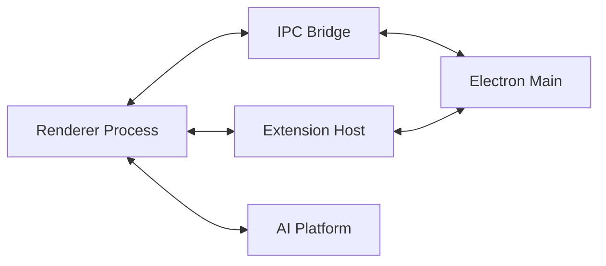

# Runtime Process Architecture

```mermaid
flowchart LR
    Renderer[Renderer Process]
    IPC[IPC Bridge]
    Main[Electron Main]
    Host[Extension Host]
    AI[AI Platform]

    Renderer <--> IPC
    IPC <--> Main
    Renderer <--> Host
    Renderer <--> AI
    Host <--> Main
```
