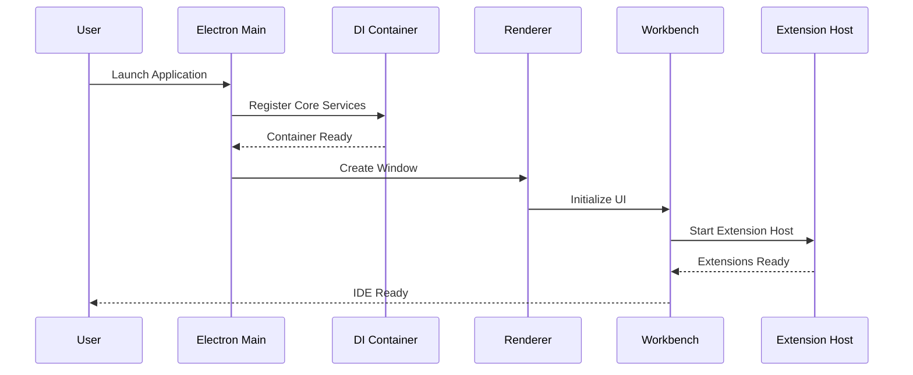

# Startup Sequence

```mermaid
sequenceDiagram
    participant U as User
    participant M as Electron Main
    participant DI as DI Container
    participant R as Renderer
    participant W as Workbench
    participant E as Extension Host

    U->>M: Launch Application
    M->>DI: Register Core Services
    DI-->>M: Container Ready
    M->>R: Create Window
    R->>W: Initialize UI
    W->>E: Start Extension Host
    E-->>W: Extensions Ready
    W-->>U: IDE Ready
```
