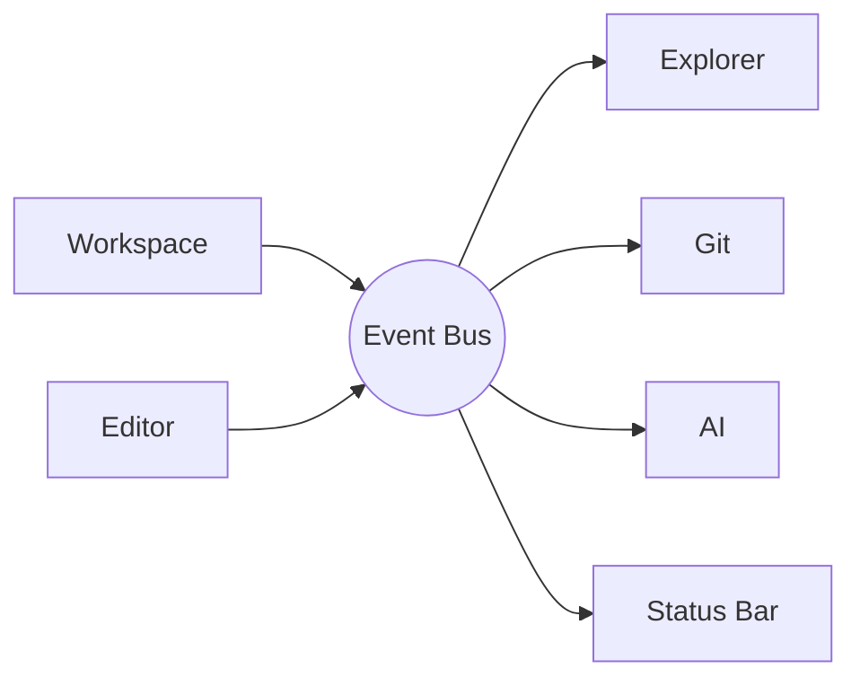

# Event Bus Flow

```mermaid
flowchart LR
    P1[Workspace]
    P2[Editor]
    BUS((Event Bus))
    C1[Explorer]
    C2[Git]
    C3[AI]
    C4[Status Bar]

    P1-->BUS
    P2-->BUS
    BUS-->C1
    BUS-->C2
    BUS-->C3
    BUS-->C4
```
