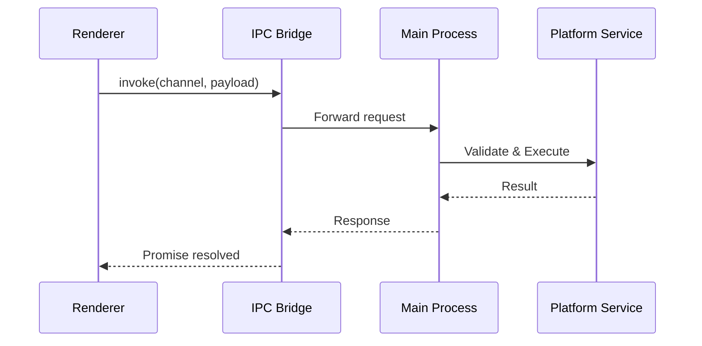

# IPC Flow

```mermaid
sequenceDiagram
    participant UI as Renderer
    participant IPC as IPC Bridge
    participant MAIN as Main Process
    participant SVC as Platform Service

    UI->>IPC: invoke(channel, payload)
    IPC->>MAIN: Forward request
    MAIN->>SVC: Validate & Execute
    SVC-->>MAIN: Result
    MAIN-->>IPC: Response
    IPC-->>UI: Promise resolved
```
