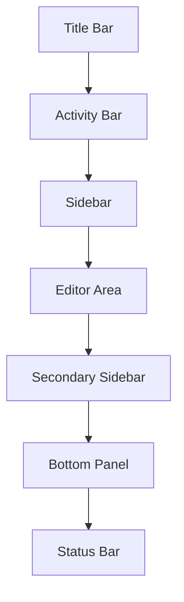

# Workbench Layout

```mermaid
flowchart TB
    TITLE[Title Bar]
    ACT[Activity Bar]
    SIDE[Sidebar]
    EDIT[Editor Area]
    SEC[Secondary Sidebar]
    PANEL[Bottom Panel]
    STATUS[Status Bar]

    TITLE --> ACT
    ACT --> SIDE
    SIDE --> EDIT
    EDIT --> SEC
    SEC --> PANEL
    PANEL --> STATUS
```
