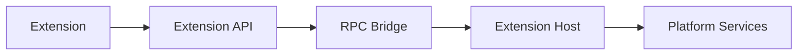
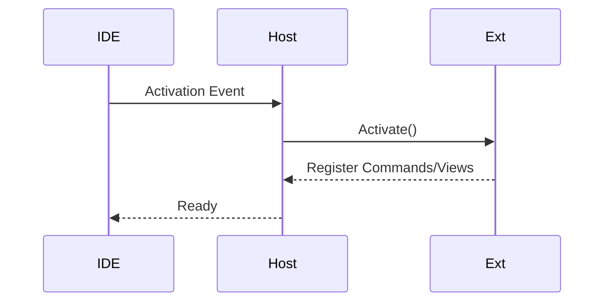

# Extension Host Architecture

```mermaid
flowchart LR
    EXT[Extension]
    API[Extension API]
    RPC[RPC Bridge]
    HOST[Extension Host]
    PLATFORM[Platform Services]

    EXT --> API
    API --> RPC
    RPC --> HOST
    HOST --> PLATFORM
```

## Activation Flow

```mermaid
sequenceDiagram
    participant IDE
    participant Host
    participant Ext

    IDE->>Host: Activation Event
    Host->>Ext: Activate()
    Ext-->>Host: Register Commands/Views
    Host-->>IDE: Ready
```
