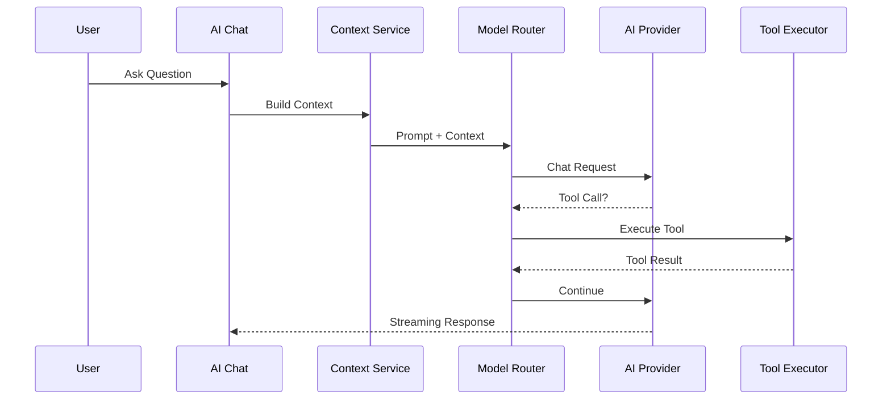

# AI Request Flow

```mermaid
sequenceDiagram
    participant U as User
    participant UI as AI Chat
    participant CTX as Context Service
    participant ROUTER as Model Router
    participant LLM as AI Provider
    participant TOOLS as Tool Executor

    U->>UI: Ask Question
    UI->>CTX: Build Context
    CTX->>ROUTER: Prompt + Context
    ROUTER->>LLM: Chat Request
    LLM-->>ROUTER: Tool Call?
    ROUTER->>TOOLS: Execute Tool
    TOOLS-->>ROUTER: Tool Result
    ROUTER->>LLM: Continue
    LLM-->>UI: Streaming Response
```
