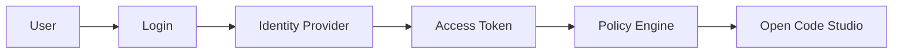
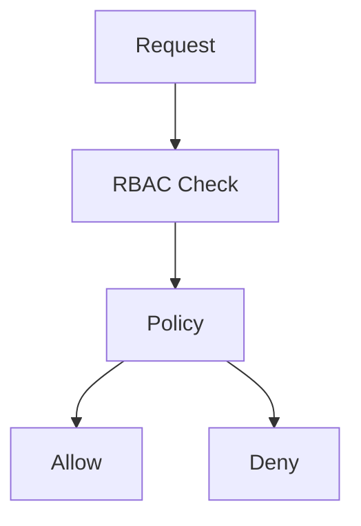

# Enterprise Authentication

```mermaid
flowchart LR
    USER[User]
    LOGIN[Login]
    IDP[Identity Provider]
    TOKEN[Access Token]
    POLICY[Policy Engine]
    APP[Open Code Studio]

    USER-->LOGIN-->IDP
    IDP-->TOKEN
    TOKEN-->POLICY
    POLICY-->APP
```

## Authorization

```mermaid
flowchart TD
    Request-->RBAC[RBAC Check]
    RBAC-->Policy
    Policy-->Allow
    Policy-->Deny
```
