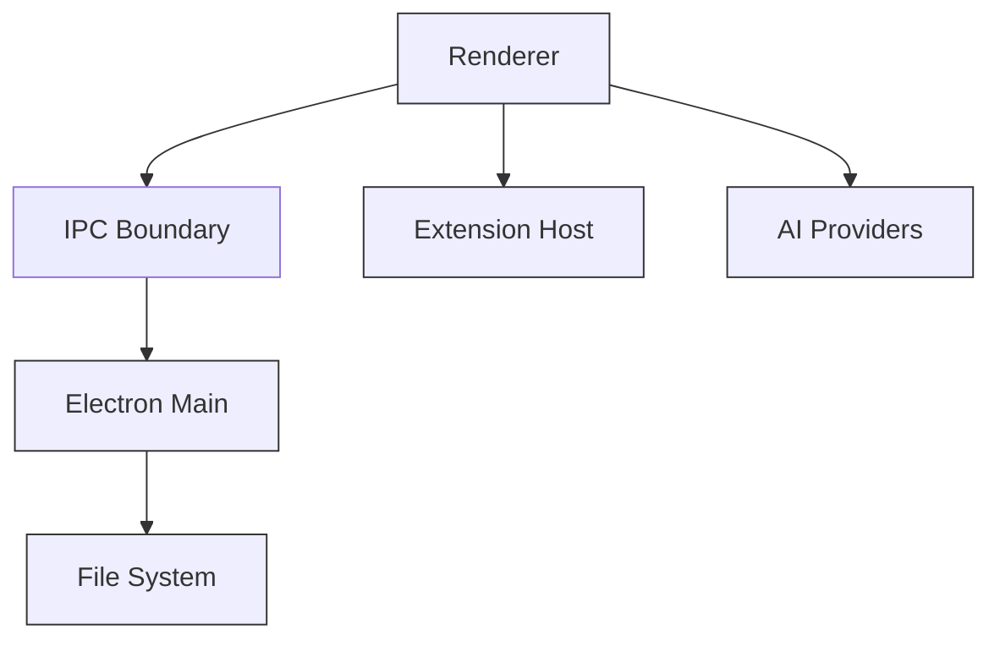

# Security Boundaries

```mermaid
flowchart TB
    UI[Renderer]
    IPC[IPC Boundary]
    MAIN[Electron Main]
    HOST[Extension Host]
    AI[AI Providers]
    FS[File System]

    UI-->IPC-->MAIN
    MAIN-->FS
    UI-->HOST
    UI-->AI

    classDef trust fill:#eef,stroke:#333;
    class UI,MAIN,HOST,AI,FS trust;
```

Key boundaries:

- Renderer ↔ Main
- Core ↔ Extensions
- IDE ↔ AI Providers
- IDE ↔ Operating System
