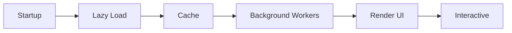
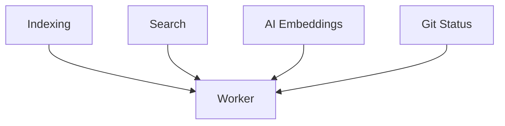

# Performance Pipeline

```mermaid
flowchart LR
    Start[Startup]
    Lazy[Lazy Load]
    Cache[Cache]
    Worker[Background Workers]
    Render[Render UI]
    Ready[Interactive]

    Start-->Lazy
    Lazy-->Cache
    Cache-->Worker
    Worker-->Render
    Render-->Ready
```

## Background Tasks

```mermaid
flowchart TB
    Index[Indexing]
    Search[Search]
    AI[AI Embeddings]
    Git[Git Status]

    Index-->Worker
    Search-->Worker
    AI-->Worker
    Git-->Worker
```
