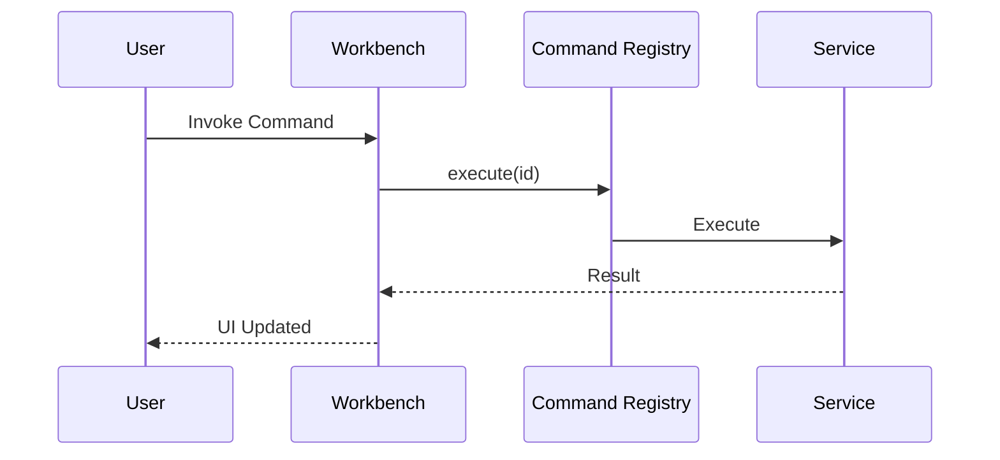

# Command Execution

```mermaid
sequenceDiagram
participant U as User
participant WB as Workbench
participant CR as Command Registry
participant S as Service

U->>WB: Invoke Command
WB->>CR: execute(id)
CR->>S: Execute
S-->>WB: Result
WB-->>U: UI Updated
```
