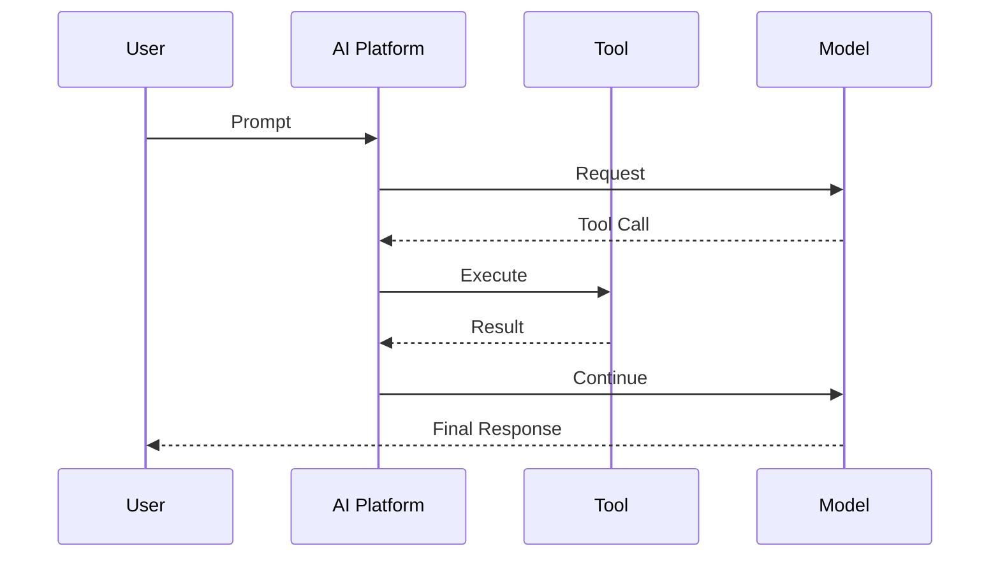

# AI Tool Calling

```mermaid
sequenceDiagram
participant U as User
participant AI as AI Platform
participant T as Tool
participant M as Model

U->>AI: Prompt
AI->>M: Request
M-->>AI: Tool Call
AI->>T: Execute
T-->>AI: Result
AI->>M: Continue
M-->>U: Final Response
```
