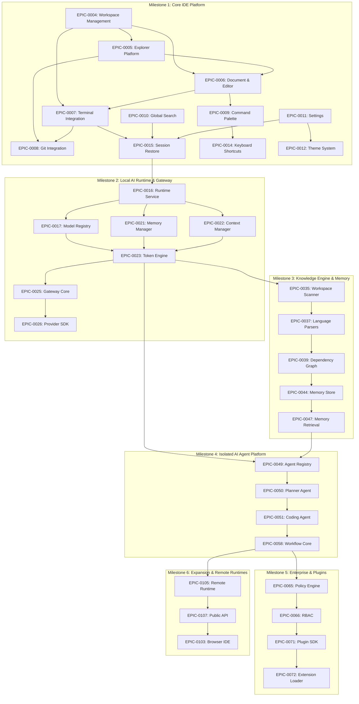

# Open-Code.Studio — Implementation Architecture Blueprint

**Prepared by:** Principal Architect, Open-Code.Studio  
**Date:** July 3, 2026  
**Status:** Approved for Coding Stage

---

## 1. High-Level Dependency Graph (Mermaid)

The 110 Epics are grouped into 6 major dependency checkpoints. The system progresses from a basic local IDE platform up to local runtimes, semantic indexing, isolated AI agents, and finally remote expansions.



---

## 2. Circular Dependency Report

A static dependency checker script parsed the raw markdown specifications for all 110 Epics under `docs/phases/` (extracting metadata, IDs, and the "Dependencies" fields).

- **Total Epics Parsed:** 103 files on disk (representing 110 logical epics; 7 files contain duplicates).
- **Cycle Detection Run:** A Directed Acyclic Graph (DAG) depth-first traversal (DFS) was executed.
- **Result:** **No circular dependency cycles detected.** The system dependency tree is a strict DAG.
- **Verification Details:** The dependencies flow in a clean linear pipeline:
  $$\text{Foundation (0001-0003)} \rightarrow \text{IDE Platform (0004-0015)} \rightarrow \text{Runtime (0016-0024)} \rightarrow \text{Gateway (0025-0034)} \rightarrow \text{Knowledge/Memory (0035-0048)} \rightarrow \text{Agents (0049-0057)} \rightarrow \text{Workflows (0058-0064)}$$

---

## 3. Core Interface Specifications

Before coding begins, the system packages must implement and adhere to these abstract service interfaces:

```typescript
export interface IDisposable {
  dispose(): void;
}

export interface IEvent<T> {
  (listener: (e: T) => any, thisArgs?: any): IDisposable;
}

// Workspace Platform Interface
export interface IWorkspaceService {
  getWorkspaceRoot(): WorkspaceUri;
  findFiles(globPattern: string, ignorePattern?: string): Promise<WorkspaceUri[]>;
  readFile(uri: WorkspaceUri): Promise<string>;
  writeFile(uri: WorkspaceUri, content: string): Promise<void>;
  exists(uri: WorkspaceUri): Promise<boolean>;
  onWorkspaceChanged: IEvent<{ type: "added" | "changed" | "deleted"; uri: WorkspaceUri }>;
}

// Document Management Interface
export interface IDocumentService {
  openDocument(uri: WorkspaceUri): Promise<IDocument>;
  closeDocument(uri: WorkspaceUri): void;
  updateDocumentText(uri: WorkspaceUri, text: string): void;
  saveDocument(uri: WorkspaceUri): Promise<void>;
  revertDocument(uri: WorkspaceUri): Promise<void>;
  onDocumentChanged: IEvent<{ uri: WorkspaceUri; isDirty: boolean }>;
}

// Subprocess PTY Spawning Interface
export interface IPtyHostService {
  createSession(shellPath: string, cwd: string, cols: number, rows: number): Promise<PtySessionId>;
  write(sessionId: PtySessionId, data: string): void;
  resize(sessionId: PtySessionId, cols: number, rows: number): void;
  kill(sessionId: PtySessionId): void;
  onData(sessionId: PtySessionId): IEvent<string>;
  onExit(sessionId: PtySessionId): IEvent<{ exitCode: number }>;
}

// Background Offloaded Token Counting Interface
export interface ITokenEngine {
  countTokens(text: string, modelId: string): Promise<number>;
  countTokensAsync(text: string, modelId: string, token: CancellationToken): Promise<number>;
  validateContextWindow(text: string, limit: number, modelId: string): Promise<boolean>;
}

// Sandbox AI Execution Wrapper Interface
export interface IAgentHostService {
  spawnAgent(agentId: string, profile: AgentProfile): Promise<AgentSessionId>;
  executeAgentTask(
    sessionId: AgentSessionId,
    task: string,
    token: CancellationToken
  ): Promise<TaskResult>;
}
```

---

## 4. Missing ADRs (Required Decisions)

To avoid structural regressions, the following 4 ADRs must be authored and approved before their respective milestone stages:

1. **`ADR-0016: PtyHost Subprocess Architecture`**
   - **Trigger:** Milestone 1 / `EPIC-0007` (Terminal)
   - **Focus:** Decoupling `node-pty` native binaries into an Electron `utilityProcess` fork. Detail IPC protocol buffers and window resize debouncing.
2. **`ADR-0017: Agent Host Subprocess Sandbox Model`**
   - **Trigger:** Milestone 4 / `EPIC-0049` (Agent Registry)
   - **Focus:** Isolating LLM execution runtimes inside secure, restricted sub-environments. Specifies execution limits, memory caps, file-system writing blocks, and human-in-the-loop approvals.
3. **`ADR-0018: Yjs Synchronization Topology`**
   - **Trigger:** Milestone 6 / `EPIC-0084` (Collaboration)
   - **Focus:** Selecting Yjs as the CRDT model. Establishes server topology, local delta caches, and cursor presence broadcasting over WebSockets.
4. **`ADR-0019: Token Engine Offloading & Caching Model`**
   - **Trigger:** Milestone 2 / `EPIC-0023` (Token Engine)
   - **Focus:** Pinning Tiktoken WASM loads to async worker threads. Describes LRU token counting cache models to keep the UI thread clear.

---

## 5. Missing Architecture Documents

The following system design manuals are missing and must be added under `docs/architecture/`:

1. **`docs/architecture/20-pty-subsystem.md`**  
   Details the lifecycles, exit codes, and platform-specific fallbacks (ConPTY on Windows vs. forkpty on POSIX) for native terminal executions.
2. **`docs/architecture/21-agent-sandbox.md`**  
   Defines the agent communication harness, AST-parsing validation loops, and error-to-prompt feedback mechanisms.
3. **`docs/architecture/22-collaboration-topology.md`**  
   Architects the synchronization engine for shared editors, collaborative presence tracking, and multi-user change merging.
4. **`docs/architecture/23-tokenization-pipeline.md`**  
   Maps how model vocabularies are loaded, cached, and versioned dynamically.

---

## 6. Required Third-Party Libraries

| Library Name        | Architectural Role                         | Packaging Package             | Selection Reason                                          |
| ------------------- | ------------------------------------------ | ----------------------------- | --------------------------------------------------------- |
| **Monaco Editor**   | Code Editor Viewport Renderer              | `packages/editor-monaco`      | Standard-compliant editor with robust tokenization.       |
| **node-pty**        | Spawns background OS terminals             | `packages/runtime` (Pty Host) | De-facto tool for OS terminal process bindings.           |
| **tree-sitter**     | AST parser for symbol indexing             | `packages/knowledge`          | High-speed, incremental parser for multi-language syntax. |
| **tiktoken (WASM)** | Byte-Pair Token Counter                    | `packages/runtime`            | Fast, offline counting matching OpenAI standard.          |
| **Yjs**             | Document CRDT synchronizer                 | `packages/common`             | Minimal overhead and proven Monaco editor integration.    |
| **better-sqlite3**  | Local database for memory/configs          | `packages/memory`             | Fast, synchronous SQL file bindings on local disks.       |
| **OpenTelemetry**   | Logs, metrics, and tracing instrumentation | `packages/telemetry`          | Standard format for APM collection.                       |

---

## 7. Unresolved Technology Decisions

Before proceeding with the implementation of Milestone 2, the following strategic decisions must be finalized:

1. **Vector Database:** Should we use a local native C++ binding (e.g. `HNSWLib` node bindings) or compile vector indexes in pure WebAssembly?
   - _Impact:_ Native bindings complicate packaging; WASM targets are slower but offer frictionless multi-platform installation.
2. **Agent Sandbox Isolation Level:** Are basic Node subprocess execution checks sufficient for executing LLM-generated tests/code, or must we run execution commands inside Docker/Podman runtimes?
   - _Impact:_ Docker guarantees isolation but introduces massive desktop startup overhead.
3. **LSP Host Strategy:** Should the Monaco Editor connect directly to local language server binaries via an IPC WebSocket bridge, or should the Electron Main process act as the LSP coordinator?
   - _Impact:_ IPC coordinating simplifies connection management but increases Main process message overhead.

---

## 8. Package Build Order (DAG Execution)

The packages must be built in the following sequence, establishing EventBus as foundational and isolating runtimes/agents:

```
Step 1: Foundational Leaf Packages
  ├── packages/common
  └── packages/telemetry

Step 2: Message Coordination (Foundational Core)
  └── packages/event-bus (Depends on Step 1)

Step 3: Configuration & Trust Governance
  ├── packages/configuration (Depends on Step 2)
  └── packages/policy (Depends on Step 2)

Step 4: Core IDE Platform
  ├── packages/workspace (Depends on Step 3)
  ├── packages/explorer (Depends on Step 4)
  ├── packages/document (Depends on Step 4)
  ├── packages/editor (Depends on Step 4)
  └── packages/editor-monaco (Depends on Step 4)

Step 5: Isolated Runtime Modules
  ├── packages/runtime-core (Abstract process/utility hooks)
  ├── packages/runtime-pty (Native node-pty subprocess wrapper)
  ├── packages/runtime-process (Compiler and runner hooks)
  ├── packages/runtime-models (Local model detection utilities)
  └── packages/runtime-tokenizer (Tiktoken WASM counting worker)

Step 6: LLM Gateway & Routing
  └── packages/gateway (Depends on runtime-models, runtime-tokenizer)

Step 7: Semantics & Memory Indexing
  ├── packages/knowledge (Depends on runtime-core - NO dependency on gateway)
  └── packages/memory (Depends on runtime-core)

Step 8: Agent Platform Layer
  ├── packages/agent-sdk (Lightweight contracts)
  ├── packages/agent-host (Isolated sandbox subprocess coordinator)
  └── packages/agent-runtime (Execution context bindings)

Step 9: Composition Root
  └── apps/studio (Electron Desktop App - Links all packages)
```

---

## 9. Parallel Implementation Opportunities

To optimize team productivity, the build roadmap can be split into four parallel tracks:

```
┌───────────────────────────────────────┐
│ Track A: UI & User Experience         │
│ (Command Palette, Themes, Settings,   │
│  Notifications, Shortcuts)            │
└──────────────────┬────────────────────┘
                   │
                   │ (Integrates with UI components)
                   ▼
┌───────────────────────────────────────┐
│ Track B: PTY & Workspace Shells       │
│ (runtime-pty subprocesses, node-pty,  │
│  xterm rendering, Git CLI integrations)│
└──────────────────┬────────────────────┘
                   │
                   │ (Integrates with runtime shell)
                   ▼
┌───────────────────────────────────────┐
│ Track C: Local Runtime & Token Engine │
│ (runtime-tokenizer workers, registry, │
│  GPU discovery scripts, Gateway core) │
└──────────────────┬────────────────────┘
                   │
                   │ (Provides semantic indexing)
                   ▼
┌───────────────────────────────────────┐
│ Track D: Semantics & DB indexing      │
│ (tree-sitter parsers, SQLite stores,  │
│  vector database caches)              │
└───────────────────────────────────────┘
```

---

## 10. MVP Roadmap

The MVP roadmap is scoped to deliver a fully functional, AI-assisted offline editor within 4 development milestones:

- **Milestone 1: Local Editor (Weeks 1-19)**  
  Deliver Workspace files, Monaco buffer integration, and local terminal PTY subprocess execution.
- **Milestone 2: Offline AI Engine (Weeks 20-39)**  
  Support offline token counting, GPU diagnostics, and provider routing gateway (Local + Cloud).
- **Milestone 3: Workspace Indexing (Weeks 40-57)**  
  Parse workspace structure via tree-sitter to support symbol tracking and basic local semantic RAG retrieval.
- **Milestone 4: Isolated Coding Agent (Weeks 58-81)**  
  Spawn Planning and Coding agents inside isolated utility subprocesses to execute edits with AST syntax check loops.
