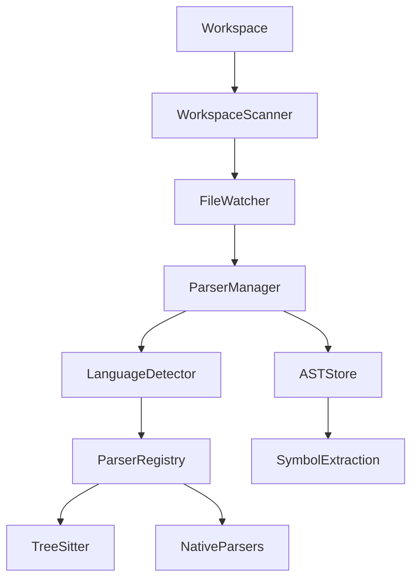

# EPIC-0037 — Language Parsers

# EPIC-0037 — Language Parsers

| Property           | Value                                                                               |
| ------------------ | ----------------------------------------------------------------------------------- |
| Epic ID            | EPIC-0037                                                                           |
| Phase              | Phase 4 — Knowledge Engine                                                          |
| Status             | 📋 Planned                                                                          |
| Priority           | Critical                                                                            |
| Estimated Duration | 4 Weeks                                                                             |
| Dependencies       | EPIC-0035 Workspace Scanner, EPIC-0036 File Watcher                                 |
| Blocks             | EPIC-0038 Symbol Extraction, EPIC-0039 Dependency Graph, EPIC-0040 Embedding Engine |

---

# 1. Overview

Language Parsers transform raw source code into structured Abstract Syntax Trees (ASTs) and normalized language models that can be consumed by every downstream component of the Knowledge Engine.

Instead of each subsystem parsing source code independently, a centralized parser platform provides a single canonical representation of every source file.

Every AI feature inside Open-Code.Studio depends on this epic.

---

# 2. Vision

Build a high-performance, incremental parsing platform supporting modern programming languages while exposing a unified API regardless of parser implementation.

Supported languages include:

- TypeScript
- JavaScript
- Python
- Go
- Java
- Kotlin
- Rust
- C
- C++
- C#
- PHP
- Ruby
- Swift
- Dart
- HTML
- CSS
- JSON
- YAML
- Markdown
- SQL

The platform must remain extensible for future languages.

---

# 3. Goals

## Functional

- Parse source files
- Produce ASTs
- Detect syntax errors
- Incremental parsing
- Multi-language support
- Parser abstraction
- Version detection
- Language auto-detection

## Non-Functional

- Cross-platform
- Parallel execution
- Low memory
- Cache aware
- Extensible
- Event driven

---

# 4. Scope

Included

- Parser Manager
- Language Detection
- AST Generation
- Parse Cache
- Parser Registry
- Incremental Parsing

Excluded

- Symbol resolution
- Dependency analysis
- Semantic indexing
- Embeddings

---

# 5. Architecture



---

# 6. Package Structure

```
packages/language-parsers/

src/

domain/
    Language
    AST
    ParseTree
    ParseResult

application/
    ParserManager
    LanguageDetector
    ParserRegistry
    IncrementalParser

providers/
    TreeSitterProvider
    NativeParserProvider

cache/
    ASTCache

events/

commands/

tests/
```

---

# 7. Domain Model

## Language

```typescript
id;

name;

version;

extensions;

parser;
```

---

## ParseResult

```typescript
language;

ast;

diagnostics;

duration;

errors;

warnings;
```

---

## AST

```typescript
root;

nodes;

tokens;

metadata;
```

---

# 8. Core Components

## Parser Manager

Responsibilities

- Coordinate parsing
- Select parser
- Cache ASTs
- Publish events
- Handle failures

---

## Language Detector

Detects language using

- Extension
- Shebang
- MIME
- Content analysis

---

## Parser Registry

Maintains

- Installed parsers
- Versions
- Capabilities
- Grammar support

---

## Incremental Parser

Only reparses modified regions.

Benefits

- Faster indexing
- Reduced CPU
- Lower memory

---

## AST Cache

Stores

- Parsed trees
- Hashes
- Metadata
- Diagnostics

---

# 9. Data Flow

```
File

↓

Language Detection

↓

Parser Selection

↓

AST Generation

↓

Cache

↓

Knowledge Engine

↓

Symbol Extraction
```

---

# 10. APIs

## ParserManager

```typescript
parse();

parseIncremental();

supportedLanguages();

registerParser();

unregisterParser();

diagnostics();
```

---

# 11. IPC Contracts

Renderer

```typescript
window.ocs.parsers;

parse();

languages();

diagnostics();
```

Main

```
parser:parse

parser:languages

parser:diagnostics
```

---

# 12. Commands

```
parser.parse

parser.reload

parser.statistics

parser.languages

parser.clearCache
```

---

# 13. Events

```
parser.started

parser.completed

parser.failed

parser.languageDetected

parser.cacheHit

parser.cacheMiss
```

---

# 14. Configuration

```yaml
parser:

incremental: true

parallel: true

cacheSize: 2GB

maxWorkers: auto

defaultProvider: tree-sitter
```

---

# 15. Stories

## STORY-0037-001

Parser Framework

Tasks

- Parser interfaces
- Registry
- Manager

---

## STORY-0037-002

Language Detection

Tasks

- Extension mapping
- MIME detection
- Content analysis

---

## STORY-0037-003

Tree-sitter Integration

Tasks

- Grammar loading
- Parsing
- Incremental updates

---

## STORY-0037-004

AST Cache

Tasks

- Hashing
- Storage
- Cache invalidation

---

## STORY-0037-005

Diagnostics

Tasks

- Syntax errors
- Parse warnings
- Performance metrics

---

# 16. Implementation Order

1. Parser Interfaces
2. Language Detector
3. Parser Registry
4. Tree-sitter Integration
5. Incremental Parser
6. AST Cache
7. Diagnostics
8. IPC
9. UI

---

# 17. Task Checklist

## Domain

- [ ] Language
- [ ] AST
- [ ] ParseResult

## Application

- [ ] ParserManager
- [ ] Registry
- [ ] Detector
- [ ] Incremental Parser

## Infrastructure

- [ ] Tree-sitter
- [ ] Native parsers
- [ ] Cache

## UI

- [ ] Diagnostics
- [ ] Statistics

---

# 18. Testing Strategy

Unit Tests

- Language detection
- Parser registry
- AST generation

Integration Tests

- Multi-language workspace
- Large repositories
- Incremental parsing

Stress Tests

- Million-line repository
- Parallel parsing
- Memory usage

---

# 19. Performance Targets

| Metric            | Target               |
| ----------------- | -------------------- |
| Parse 1 File      | <50 ms               |
| Incremental Parse | <10 ms               |
| Cache Hit         | >95%                 |
| CPU Usage         | <50% during indexing |

---

# 20. Security Considerations

- Never execute parsed code
- Validate parser inputs
- Sandbox parser providers
- Detect malformed grammars
- Prevent parser crashes

---

# 21. Definition of Done

- All supported languages parse successfully
- Incremental parsing implemented
- AST cache operational
- Unit coverage ≥90%
- Integration tests passing
- Performance targets achieved
- Documentation completed

---

# 22. Acceptance Criteria

- Source files parse correctly
- ASTs are generated consistently
- Incremental parsing minimizes work
- Parser failures don't crash indexing
- Multiple languages supported simultaneously

---

# 23. Risks

| Risk                    | Mitigation                |
| ----------------------- | ------------------------- |
| Grammar incompatibility | Versioned parser registry |
| Large ASTs              | Incremental parsing       |
| Memory usage            | AST cache eviction        |
| Unsupported languages   | Plugin architecture       |

---

# 24. Future Enhancements

- AI-assisted grammar generation
- WASM parsers
- Remote parsing
- Distributed parsing
- Live syntax trees
- Language plugins

---

# 25. Deliverables

- Parser Framework
- Language Detector
- Parser Registry
- Tree-sitter Integration
- AST Cache
- Diagnostics
- IPC Contracts

---

# 26. Traceability

Requirements

- REQ-KE-001 Language Parsing
- REQ-KE-002 AST Generation
- REQ-KE-003 Incremental Parsing

Related ADRs

- ADR-081 Parser Architecture
- ADR-082 Tree-sitter Integration

Events

- parser.started
- parser.completed

Commands

- parser.parse
- parser.reload

---

# 27. Changelog

## v1.0.0

- Initial Language Parser specification
- Added parser framework
- Added Tree-sitter integration
- Added incremental parsing
- Added AST caching
- Added diagnostics
