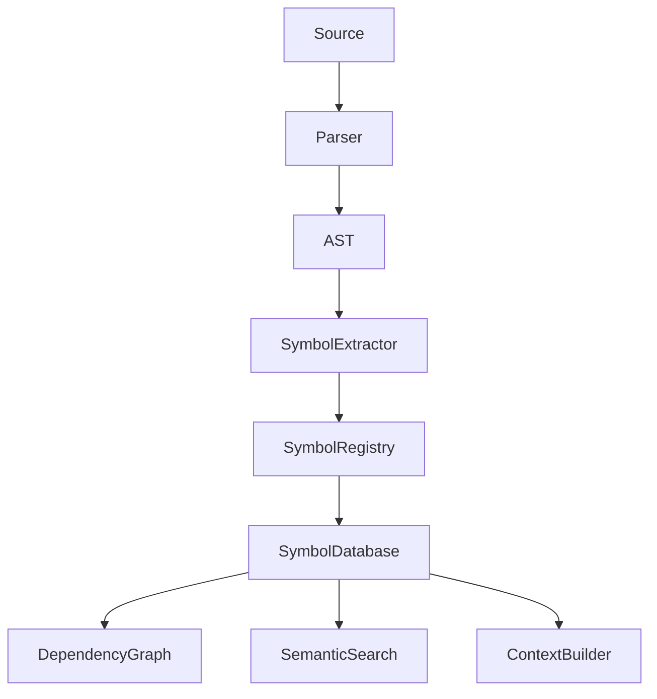

# EPIC-0038 — Symbol Extraction

# EPIC-0038 — Symbol Extraction

| Property           | Value                                                                            |
| ------------------ | -------------------------------------------------------------------------------- |
| Epic ID            | EPIC-0038                                                                        |
| Phase              | Phase 4 — Knowledge Engine                                                       |
| Status             | 📋 Planned                                                                       |
| Priority           | Critical                                                                         |
| Estimated Duration | 4 Weeks                                                                          |
| Dependencies       | EPIC-0037 Language Parsers                                                       |
| Blocks             | EPIC-0039 Dependency Graph, EPIC-0041 Semantic Search, EPIC-0042 Context Builder |

---

# 1. Overview

The Symbol Extraction Engine transforms Abstract Syntax Trees (ASTs) into a structured symbol database representing every code element within the workspace.

Rather than repeatedly traversing ASTs, downstream systems consume normalized symbols.

The Symbol Engine is the backbone of intelligent navigation, semantic search, code understanding, and AI context generation.

---

# 2. Vision

Create a language-agnostic symbol platform capable of understanding any programming language while exposing a unified symbol model.

Supported symbols include:

- Packages
- Modules
- Classes
- Interfaces
- Structs
- Enums
- Functions
- Methods
- Constructors
- Variables
- Constants
- Parameters
- Properties
- Namespaces
- Imports
- Exports
- Types
- Generics
- Decorators
- Annotations

---

# 3. Goals

## Functional

- Extract symbols
- Normalize symbols
- Cross-language representation
- Incremental extraction
- Symbol indexing
- Duplicate detection
- Relationship mapping
- Diagnostics

## Non-Functional

- Fast
- Incremental
- Extensible
- Parallel
- Language independent

---

# 4. Scope

Included

- Symbol Engine
- Symbol Registry
- Symbol Relationships
- Symbol Database
- Incremental Updates

Excluded

- Dependency analysis
- Embeddings
- Semantic ranking

---

# 5. Architecture



---

# 6. Package Structure

```
packages/symbol-extractor/

src/

domain/
    Symbol
    SymbolKind
    SymbolReference
    SymbolLocation

application/
    SymbolExtractor
    SymbolRegistry
    SymbolIndexer
    RelationshipBuilder

storage/
    SymbolStore

events/

commands/

tests/
```

---

# 7. Domain Model

## Symbol

```typescript
id;

name;

qualifiedName;

kind;

language;

location;

visibility;

documentation;

metadata;
```

---

## Symbol Reference

```typescript
source;

target;

type;

location;
```

---

## Symbol Location

```typescript
file;

line;

column;

offset;
```

---

# 8. Core Components

## Symbol Extractor

Responsibilities

- Walk AST
- Create symbols
- Publish events
- Detect relationships

---

## Symbol Registry

Maintains

- All symbols
- Language mappings
- IDs
- Symbol metadata

---

## Relationship Builder

Creates

- Parent-child
- Calls
- Implements
- Extends
- References
- Overrides

---

## Symbol Store

Stores

- Symbols
- References
- Metadata
- Documentation

Supports incremental updates.

---

# 9. Data Flow

```
AST

↓

Node Visitor

↓

Symbol Extraction

↓

Relationship Builder

↓

Symbol Registry

↓

Knowledge Store
```

---

# 10. APIs

```typescript
extract();

extractIncremental();

symbols();

find();

references();

relationships();
```

---

# 11. IPC Contracts

Renderer

```typescript
window.ocs.symbols;

find();

references();

relationships();
```

Main

```
symbols:find

symbols:references

symbols:relationships
```

---

# 12. Commands

```
symbols.extract

symbols.refresh

symbols.find

symbols.references

symbols.statistics
```

---

# 13. Events

```
symbol.created

symbol.updated

symbol.deleted

symbol.relationshipBuilt

symbol.indexCompleted
```

---

# 14. Configuration

```yaml
symbols:

incremental: true

cache: true

storeDocumentation: true

maxWorkers: auto
```

---

# 15. Stories

## STORY-0038-001

Symbol Domain

- Symbol models
- Types
- Locations

---

## STORY-0038-002

Extractor Engine

- AST visitors
- Incremental extraction
- Diagnostics

---

## STORY-0038-003

Relationship Builder

- Calls
- References
- Inheritance

---

## STORY-0038-004

Registry

- Symbol database
- Lookup
- Indexes

---

## STORY-0038-005

Diagnostics

- Statistics
- Validation
- Performance

---

# 16. Implementation Order

1. Domain models
2. AST visitors
3. Registry
4. Relationship builder
5. Symbol database
6. IPC
7. Diagnostics

---

# 17. Task Checklist

## Domain

- [ ] Symbol
- [ ] Reference
- [ ] Location

## Application

- [ ] Extractor
- [ ] Registry
- [ ] Indexer

## Storage

- [ ] Symbol Store
- [ ] Relationship Store

## UI

- [ ] Symbol Explorer
- [ ] Statistics

---

# 18. Testing Strategy

Unit

- Extraction
- Relationships
- Lookups

Integration

- Multi-language
- Incremental updates

Performance

- Million symbol workspace

---

# 19. Performance Targets

| Metric             | Target       |
| ------------------ | ------------ |
| Extraction         | <100 ms/file |
| Symbol Lookup      | <5 ms        |
| Reference Search   | <20 ms       |
| Incremental Update | <10 ms       |

---

# 20. Security Considerations

- Never execute code
- Validate parser output
- Prevent malformed AST attacks
- Isolate parser providers

---

# 21. Definition of Done

- Symbols extracted correctly
- Relationships generated
- Registry indexed
- Incremental updates supported
- Coverage ≥90%

---

# 22. Acceptance Criteria

- All supported languages produce symbols
- Symbol lookups are accurate
- References resolve correctly
- Relationships are complete
- Incremental updates work

---

# 23. Risks

| Risk                 | Mitigation          |
| -------------------- | ------------------- |
| Language differences | Common symbol model |
| Large symbol counts  | Indexed storage     |
| Missing references   | Validation          |
| Duplicate symbols    | Stable IDs          |

---

# 24. Future Enhancements

- AI-generated documentation
- Symbol metrics
- Cross-repository symbols
- Live symbol updates
- Plugin symbol providers

---

# 25. Deliverables

- Symbol Engine
- Symbol Registry
- Relationship Builder
- Symbol Database
- Diagnostics

---

# 26. Traceability

Requirements

- REQ-KE-004 Symbol Extraction
- REQ-KE-005 Symbol Relationships

Related ADRs

- ADR-083 Symbol Model
- ADR-084 Relationship Graph

Events

- symbol.created
- symbol.updated

Commands

- symbols.extract
- symbols.find

---

# 27. Changelog

## v1.0.0

- Initial Symbol Extraction specification
- Added Symbol Registry
- Added Relationship Builder
- Added Symbol Store
- Added APIs and IPC
