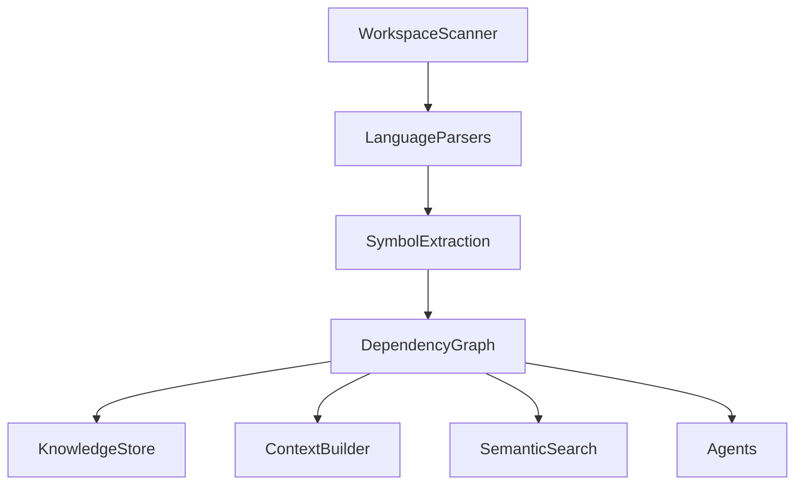

# EPIC-0039 — Dependency Graph

# EPIC-0039 — Dependency Graph

| Property           | Value                                                                                                    |
| ------------------ | -------------------------------------------------------------------------------------------------------- |
| Epic ID            | EPIC-0039                                                                                                |
| Phase              | Phase 4 — Knowledge Engine                                                                               |
| Status             | 📋 Planned                                                                                               |
| Priority           | Critical                                                                                                 |
| Estimated Duration | 4 Weeks                                                                                                  |
| Dependencies       | EPIC-0037 Language Parsers, EPIC-0038 Symbol Extraction                                                  |
| Blocks             | EPIC-0040 Embedding Engine, EPIC-0041 Semantic Search, EPIC-0042 Context Builder, Phase 6 Agent Platform |

---

# 1. Overview

The Dependency Graph Engine constructs a unified graph representing relationships across every artifact in a workspace.

Rather than analyzing files independently, Open-Code.Studio maintains a continuously updated graph that connects files, symbols, packages, projects, APIs, tests, documentation, and external dependencies.

The Dependency Graph becomes the "knowledge backbone" of the IDE.

---

# 2. Vision

Build an incremental graph database capable of representing every dependency within a software project regardless of language or framework.

Supported dependency types include:

- File imports
- Package dependencies
- Function calls
- Class inheritance
- Interface implementation
- Module references
- Symbol references
- Build dependencies
- Test dependencies
- Documentation references
- Workspace relationships

---

# 3. Goals

## Functional

- Build dependency graph
- Incremental graph updates
- Cross-language support
- Graph queries
- Cycle detection
- Relationship traversal
- Dependency impact analysis
- Graph export

## Non-Functional

- Incremental
- Scalable
- Memory efficient
- Parallel
- Query optimized
- Event driven

---

# 4. Scope

Included

- Dependency Graph Engine
- Graph Builder
- Relationship Index
- Graph Query API
- Cycle Detection
- Impact Analysis

Excluded

- Embeddings
- Semantic ranking
- AI reasoning
- Workflow analysis

---

# 5. Architecture



---

# 6. Package Structure

```
packages/dependency-graph/

src/

domain/
    GraphNode
    GraphEdge
    Dependency
    Relationship

application/
    GraphBuilder
    DependencyAnalyzer
    GraphQueryService
    CycleDetector

storage/
    GraphStore
    GraphIndex

algorithms/
    Traversal
    TopologicalSort
    SCCDetection
    ImpactAnalysis

events/

commands/

tests/
```

---

# 7. Domain Model

## Graph Node

```typescript
id;

type;

name;

workspace;

metadata;
```

---

## Graph Edge

```typescript
source;

target;

relationship;

weight;

metadata;
```

---

## Dependency

```typescript
type;

scope;

language;

resolved;

version;
```

---

# 8. Core Components

## Graph Builder

Responsibilities

- Build graph
- Update graph
- Remove stale nodes
- Publish graph events

---

## Dependency Analyzer

Analyzes

- Imports
- References
- Package usage
- Symbol dependencies
- Build dependencies

---

## Graph Query Service

Supports

- Node lookup
- Traversal
- Reverse lookup
- Reachability
- Path finding

---

## Cycle Detector

Detects

- Circular imports
- Circular references
- Circular packages
- Circular inheritance

---

## Impact Analyzer

Determines

- Change impact
- Dependency depth
- Affected files
- Affected symbols
- Build impact

---

# 9. Data Flow

```
AST

↓

Symbols

↓

Relationships

↓

Dependency Graph

↓

Knowledge Store

↓

AI Context Builder
```

---

# 10. APIs

```typescript
build()

update()

query()

neighbors()

shortestPath()

findCycles()

impact()

export()
```

---

# 11. IPC Contracts

Renderer

```typescript
window.ocs.graph;

query();

impact();

cycles();

statistics();
```

Main

```
graph:query

graph:impact

graph:cycles

graph:statistics
```

---

# 12. Commands

```
graph.build

graph.refresh

graph.query

graph.export

graph.cycles

graph.statistics
```

---

# 13. Events

```
graph.created

graph.updated

graph.nodeAdded

graph.edgeAdded

graph.cycleDetected

graph.analysisCompleted
```

---

# 14. Configuration

```yaml
graph:

incremental: true

storeReverseEdges: true

detectCycles: true

cacheQueries: true

maxTraversalDepth: 100
```

---

# 15. Stories

## STORY-0039-001

Graph Domain

Tasks

- Node model
- Edge model
- Relationships

---

## STORY-0039-002

Graph Builder

Tasks

- Build graph
- Update graph
- Delete nodes

---

## STORY-0039-003

Dependency Analysis

Tasks

- Imports
- References
- Packages
- Modules

---

## STORY-0039-004

Graph Algorithms

Tasks

- Traversal
- SCC detection
- Topological sort
- Shortest path

---

## STORY-0039-005

Impact Analysis

Tasks

- Change analysis
- Dependency depth
- Risk analysis

---

# 16. Implementation Order

1. Graph models
2. Graph store
3. Builder
4. Dependency analyzer
5. Graph algorithms
6. Query API
7. Diagnostics
8. IPC

---

# 17. Task Checklist

## Domain

- [ ] GraphNode
- [ ] GraphEdge
- [ ] Dependency

## Application

- [ ] GraphBuilder
- [ ] Analyzer
- [ ] QueryService
- [ ] ImpactAnalyzer

## Infrastructure

- [ ] GraphStore
- [ ] GraphIndex
- [ ] Algorithms

## UI

- [ ] Dependency Explorer
- [ ] Graph Viewer
- [ ] Impact Viewer

---

# 18. Testing Strategy

Unit Tests

- Graph creation
- Traversal
- Cycle detection

Integration Tests

- Multi-language projects
- Monorepos
- Large dependency trees

Performance Tests

- 1M+ graph nodes
- Large traversal
- Incremental updates

---

# 19. Performance Targets

| Metric             | Target               |
| ------------------ | -------------------- |
| Graph Build        | <30 sec (100k files) |
| Incremental Update | <100 ms              |
| Query              | <10 ms               |
| Impact Analysis    | <100 ms              |
| Cycle Detection    | <1 sec               |

---

# 20. Security Considerations

- Read-only workspace analysis
- Validate graph integrity
- Prevent malformed relationships
- Protect against graph corruption
- No execution of analyzed code

---

# 21. Definition of Done

- Graph builds successfully
- Incremental updates work
- Queries optimized
- Cycle detection operational
- Impact analysis accurate
- Coverage ≥90%
- Documentation complete

---

# 22. Acceptance Criteria

- Dependencies accurately represented
- Cross-language relationships supported
- Graph updates incrementally
- Query performance meets targets
- Impact analysis identifies affected artifacts
- Circular dependencies detected reliably

---

# 23. Risks

| Risk                  | Mitigation                     |
| --------------------- | ------------------------------ |
| Large graphs          | Incremental updates & indexing |
| Circular dependencies | SCC detection                  |
| Memory growth         | Graph compression              |
| Slow traversal        | Indexed graph queries          |

---

# 24. Future Enhancements

- Distributed graph engine
- Graph visualization
- AI-assisted dependency analysis
- Architectural rule validation
- Graph version history
- Cross-repository dependency graph
- GraphQL query interface

---

# 25. Deliverables

- Dependency Graph Engine
- Graph Builder
- Dependency Analyzer
- Graph Query API
- Impact Analyzer
- Cycle Detector
- Graph Store
- Visualization Components

---

# 26. Traceability

Requirements

- REQ-KE-006 Dependency Graph
- REQ-KE-007 Graph Queries
- REQ-KE-008 Impact Analysis
- REQ-KE-009 Cycle Detection

Related ADRs

- ADR-085 Dependency Graph Architecture
- ADR-086 Graph Storage Model
- ADR-087 Graph Query Engine

Events

- graph.created
- graph.updated
- graph.cycleDetected

Commands

- graph.build
- graph.query
- graph.export

---

# 27. Changelog

## v1.0.0

- Initial Dependency Graph specification
- Added Graph Builder
- Added Query Engine
- Added Dependency Analyzer
- Added Cycle Detection
- Added Impact Analysis
- Added Graph Store
- Added APIs, IPC, Commands, and Events
