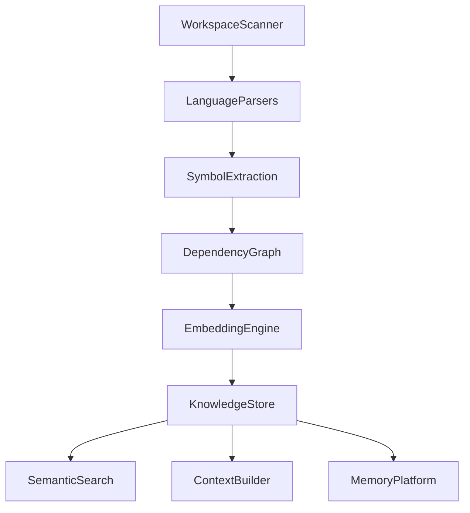

# EPIC-0043 — Knowledge Store

# EPIC-0043 — Knowledge Store

| Property           | Value                                                                                                        |
| ------------------ | ------------------------------------------------------------------------------------------------------------ |
| Epic ID            | EPIC-0043                                                                                                    |
| Phase              | Phase 4 — Knowledge Engine                                                                                   |
| Status             | 📋 Planned                                                                                                   |
| Priority           | Critical                                                                                                     |
| Estimated Duration | 4 Weeks                                                                                                      |
| Dependencies       | EPIC-0039 Dependency Graph, EPIC-0040 Embedding Engine, EPIC-0041 Semantic Search, EPIC-0042 Context Builder |
| Blocks             | Phase 5 Memory Platform, Phase 6 Agent Platform                                                              |

---

# 1. Overview

The Knowledge Store is the persistent intelligence layer of Open-Code.Studio.

It consolidates parsed source code, symbols, dependency graphs, embeddings, semantic indexes, documentation, metadata, and AI context into a unified storage platform.

Rather than every subsystem maintaining independent indexes, the Knowledge Store becomes the authoritative repository powering every AI feature.

---

# 2. Vision

Create a high-performance, language-agnostic knowledge database optimized for AI-assisted software engineering.

Stores

- Files
- Symbols
- AST Metadata
- Dependency Graph
- Embeddings
- Semantic Indexes
- Documentation
- Generated Metadata

---

# 3. Goals

## Functional

- Unified storage
- Incremental updates
- Version tracking
- Snapshot support
- Fast retrieval
- Workspace isolation

## Non-Functional

- ACID compliant
- Incremental
- Highly indexed
- Scalable
- Extensible

---

# 4. Scope

Included

- Knowledge Database
- Metadata Store
- Vector References
- Graph References
- Snapshot Manager

Excluded

- Memory
- Prompt history
- User preferences

---

# 5. Architecture



---

# 6. Components

- Knowledge Repository
- Metadata Store
- Index Manager
- Snapshot Manager
- Query Service
- Synchronization Engine

---

# 7. APIs

```typescript
store()

update()

delete()

query()

snapshot()

statistics()
```

---

# 8. IPC

```
knowledge:query

knowledge:update

knowledge:statistics
```

---

# 9. Commands

```
knowledge.build
knowledge.refresh
knowledge.snapshot
knowledge.statistics
```

---

# 10. Events

```
knowledge.updated
knowledge.snapshotCreated
knowledge.rebuilt
knowledge.optimized
```

---

# 11. Stories

- Knowledge Repository
- Snapshot Manager
- Index Management
- Synchronization
- Query Engine

---

# 12. Tasks

- [ ] Database schema
- [ ] Storage engine
- [ ] Snapshot manager
- [ ] Query engine
- [ ] Optimization
- [ ] Metrics

---

# 13. Performance

| Metric   | Target |
| -------- | ------ |
| Query    | <20 ms |
| Update   | <50 ms |
| Snapshot | <5 sec |
| Startup  | <2 sec |

---

# 14. Definition of Done

- Persistent storage operational
- Incremental synchronization
- Snapshots implemented
- Coverage ≥90%

---

# 15. Acceptance Criteria

- Knowledge persists across sessions
- Fast retrieval
- Incremental updates
- Snapshot restoration succeeds

---

# 16. Risks

- Database growth
- Index fragmentation
- Corruption

---

# 17. Future

- Distributed knowledge store
- Cloud synchronization
- Multi-workspace federation

---

# 18. Deliverables

- Knowledge Store
- Query Engine
- Snapshot Manager
- Synchronization Service

---

# 19. Traceability

Requirements

- REQ-KE-016
- REQ-KE-017

Related ADRs

- ADR-092 Knowledge Store

---

# 20. Changelog

v1.0 Initial Specification
