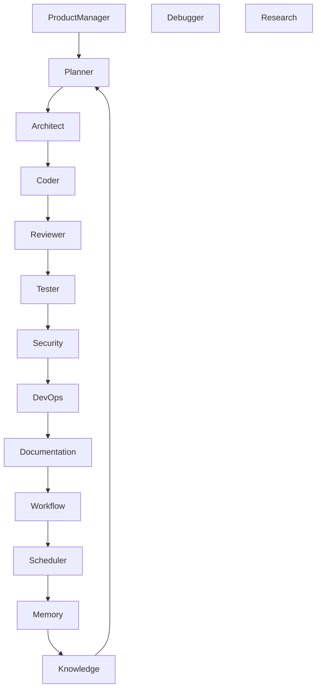

# EPIC-0110 — Distributed Multi-Agent Platform

| Property           | Value                         |
| ------------------ | ----------------------------- |
| Epic ID            | EPIC-0110                     |
| Phase              | Phase 15 — Platform Expansion |
| Status             | 🔮 Visionary                  |
| Priority           | Strategic                     |
| Estimated Duration | 12+ Weeks                     |
| Dependencies       | Entire Platform               |
| Blocks             | Future Platform Evolution     |

---

# 1. Overview

The Distributed Multi-Agent Platform is the long-term vision of Open-Code.Studio.

Instead of relying on a single AI assistant, the platform orchestrates fleets of specialized autonomous agents that collaborate to design, implement, review, test, deploy, monitor, and continuously improve software systems.

Each agent possesses specialized knowledge, independent memory, dedicated tools, and collaborative reasoning capabilities.

---

# 2. Vision

Transform Open-Code.Studio into an autonomous software engineering organization.

Agent Categories

- Planner Agent
- Architect Agent
- Coding Agent
- Review Agent
- Testing Agent
- Documentation Agent
- Security Agent
- DevOps Agent
- Refactoring Agent
- Debugging Agent
- Research Agent
- Product Manager Agent

---

# 3. Goals

## Functional

- Distributed agent execution
- Agent collaboration
- Shared memory
- Agent communication
- Task delegation
- Autonomous planning
- Consensus algorithms
- Self-improvement

---

# 4. Scope

Included

- Agent Orchestrator
- Distributed Scheduler
- Agent Communication Bus
- Shared Knowledge Graph
- Consensus Engine
- Agent Marketplace

Excluded

- Artificial General Intelligence

---

# 5. Architecture



---

# 6. Components

- Agent Orchestrator
- Distributed Scheduler
- Communication Bus
- Consensus Engine
- Shared Memory
- Knowledge Graph
- Agent Registry
- Resource Manager

---

# 7. APIs

```typescript
createAgent();

assignTask();

delegate();

coordinate();

consensus();

cluster();

statistics();
```

---

# 8. IPC

```
agent.cluster

agent.delegate

agent.consensus

agent.communication
```

---

# 9. Commands

```
agent.cluster.start
agent.cluster.stop
agent.cluster.status
agent.cluster.scale
```

---

# 10. Events

```
agent.created
task.delegated
consensus.reached
workflow.completed
cluster.scaled
```

---

# 11. Stories

- Distributed orchestration
- Agent collaboration
- Consensus
- Shared knowledge
- Autonomous planning
- Resource scheduling

---

# 12. Tasks

- [ ] Distributed scheduler
- [ ] Communication bus
- [ ] Consensus engine
- [ ] Shared knowledge graph
- [ ] Cluster manager
- [ ] Agent scaling
- [ ] Resource allocation

---

# 13. Performance

| Metric          | Target  |
| --------------- | ------- |
| Agent Spawn     | <1 sec  |
| Task Delegation | <50 ms  |
| Consensus       | <500 ms |
| Cluster Scaling | <5 sec  |

---

# 14. Definition of Done

- Multi-agent orchestration operational
- Distributed execution supported
- Consensus engine validated
- Shared memory synchronized
- Coverage ≥90%

---

# 15. Acceptance Criteria

- Agents collaborate autonomously
- Tasks delegated correctly
- Failures recovered automatically
- Knowledge synchronized
- Platform scales horizontally

---

# 16. Risks

- Coordination deadlocks
- Resource starvation
- Agent disagreement
- Cost explosion
- Emergent behavior complexity

---

# 17. Future

- Federated AI organizations
- Cross-enterprise agent collaboration
- Self-evolving agent ecosystems
- Autonomous product development
- Self-optimizing engineering organizations

---

# 18. Deliverables

- Distributed Agent Platform
- Agent Orchestrator
- Communication Bus
- Consensus Engine
- Shared Knowledge Graph
- Cluster Manager

---

# 19. Traceability

Requirements

- REQ-LAB-003
- REQ-LAB-004
- REQ-LAB-005

Related ADRs

- ADR-159 Distributed Multi-Agent Platform

---

# 20. Changelog

v1.0 Initial Specification
